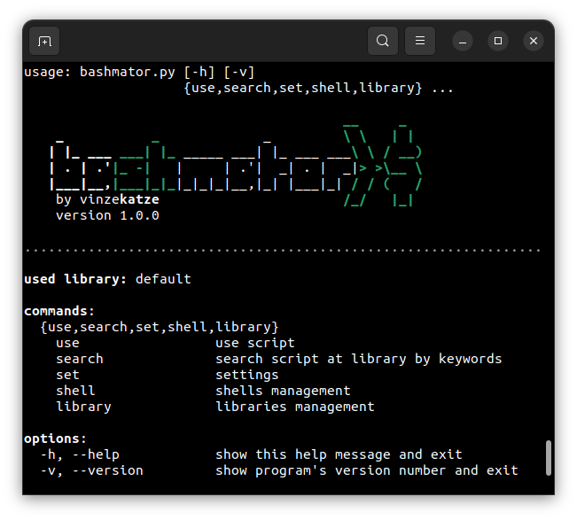

<h3 align="center">
  
</h3>

Основная задача программы - предоставить единую легко дополняемую среду для запуска, систематизации, поиска и логирования большого количества однострочников и небольших скриптов.

Каждый отдельный скрипт или набор скриптов записываются в YAML-файл, из которого bashmator генерирует аргументы командной строки, подставляет их значения в указанные точки и запускает скрипт в указанной оболочке.

В папке со скриптами (библиотеке) bashmator создает файл `library.json` и поддерживает его актуальность. В данном файле записывается информация о доступных скриптах, что избавляет от необходимости парсить все YAML-файлы при каждом запуске программы.

# Установка
```
git clone https://github.com/vinzekatze/bashmator
cd ./bashmator
pip install -r requirements.txt
```
Добавить оболочку bash:
```
./bashmator.py shell add /usr/bin/bash
```
Добавить в PATH:
```
sudo ln -s $(pwd)/bashmator.py /usr/local/bin/bashmator
```
# Функционал и особенности работы
Для каждой команды в программе доступна помощь, вызываемая с помощью флага `-h` или `--help`:

<details>
  <summary><code>bashmator use --help</code></summary>
  
```
usage: bashmator use [-l] [-o FILE] [-i] [-c] [-h] script ...

Runs a script from the library by it's name.

................................................................................

positional arguments:
  script               script name and it's options

script launch options:
  -l, --log-headers    print log headers when executing script
  -o FILE, --out FILE  log execution process to file (append mod)

code printing options:
  -i, --install        show script's installation information
  -c, --code           print script without execution

other options:
  -h, --help           show this help message and exit
```
  
</details>
<details>
  <summary><code>bashmator search --help</code></summary>
  
```
usage: bashmator search [-i] [-A] [-D] [-S] [-h] [keyword ...]

Search for a script in the used library. By default, the search is performed by
tags and script names.

................................................................................

positional arguments:
  keyword            keywords for search

search options:
  -i, --ignore-case  ignore case distinctions
  -A, --author       add search by author
  -D, --description  add search by script description
  -S, --shell        add search by shell

other options:
  -h, --help         show this help message and exit

```
  
</details>

<details>
  <summary><code>bashmator set --help</code></summary>
  
```
usage: bashmator set [--auto-scan {true,false}] [--color {true,false}] [-h]

Current setings:
  auto-scan True
  color True

................................................................................

settings:
  --auto-scan {true,false}
                        automatically detect changes in the used library
  --color {true,false}  use color on the command line

other options:
  -h, --help            show this help message and exit

```

</details>

<details>
  <summary><code>bashmator shell --help</code></summary>
  
```
usage: bashmator shell [-h] {add,delete} ...

commands:
  {add,delete}
    add         add a new shell to the known list
    delete      remove a shell from the known list

options:
  -h, --help    show this help message and exit

................................................................................

known shells:
 name   | path          | popen arguments   | encoding
--------+---------------+-------------------+------------
 bash   | /usr/bin/bash | ['-c']            | utf-8

```
  
</details>

<details>
  <summary><code>bashmator library --help</code></summary>

```
usage: bashmator library [-h] {add,delete,scan,use} ...

commands:
  {add,delete,scan,use}
    add                 add a new library to the known list
    delete              remove library from the known list
    scan                detect changes in the used library
    use                 select library for use

options:
  -h, --help            show this help message and exit

................................................................................

known libraries:
 name    | status   | path
---------+----------+---------------------------------------------
 default | IN USE   | /home/kali/workspace/apps/bashmator/library

```

</details>

## Оболочки
Не смотря на название, bashmator способен работать не только с bash. Ниже представлены примеры команды на добавление некоторых других оболочек, интерпритаторов и программ:
```sh
bashmator shell add /usr/bin/zsh
bashmator shell add /usr/bin/python3
bashmator shell add /usr/bin/node --popen-args '["-e"]'
bashmator shell add /usr/bin/msfconsole --popen-args '["-q", "-x"]'
```
Потенциально bashmator способен работать с любыми интерпритаторами, способных принимать последовательность команд из аргументов командной строки. Флаг, отвечающий за прием последовательности команд, должен всегда располагаться в конце списка, передаваемого в аргументе `--popen-args`.

## Библиотеки
Рекомендуется создавать собственные библиотеки, а не добавлять свои скрипты в библиотеку по умолчанию.

Чтобы создать библиотеку достаточно создать каталог, содержащий каталоги `files` и `modules`. В `files` следует располагать файлы, к которым будут обращаться ваши скрипты без привязки к путям используемой файловой системы, а в `modules` - ваши YAML-ы. Далее необходимо добавить вашу библиотеку в bashmator и выбрать её для использования:
```
bashmator library add <path to your library>
bashmator library use <your lirary name>
```

# Структура YAML
Минимая структура файла, необходимая для работы:
```yaml
shell: <SHELL NAME>
script: |-
  <YOUR CODE>
```
Полный набор ключей, доступных на данный момент:
<details>
  <summary>YAML</summary>

```yaml
author: <NAME>
description: <TEXT>
tags:
  - <TAG1>
  - <TAG2>
  - ...
install: <INSTALLATION INFORMATION>

arguments:
  <ARG NAME>:
    default: <EMPTY, STRING OR LIST>
    replacer: <VALUE REPLACER>
    description: <TEXT>
    multiple: <TRUE | FALSE>
  <OTHER ARG NAME>:
    ...
  ...

mode:
  loop: <MULTIPLE ARG NAME>
  join:
    <MULTIPLE ARG NAME>: <DELIMITER>
    <OTHER ARG>: ...
    ...
  format:
    <ARG NAME>: <.format() TEMPLATE>
    <OTHER ARG>: ...
    ...

shell: <MAIN SHELL SHORT NAME OR PATH>
script: |- 
  <YOUR MAIN CODE>

file_<NUMBER>:
  path: <SHORT PATH TO FILE AT LIBRARY/FILES DIRECTORY>
  replacer: <FULL PATH REPLACER>
  description: <TEXT>
file_<OTHER NUMBER>:
  ...
...

item_<NUMBER>:
  shell: <OTHER SHELL SHORT NAME OR PATH>
  description: <TEXT>
  mode: 
    <SAME STRUCTURE AS AT MAIN>
  script: |-
    <YOUR OTHER CODE>
item_<OTHER NUMBER>:
  ...
...
```

</details>

C назначением данных ключей и их влиянием на работу программы можно ознакомиться на примерах, представленных во [встроенной библиотеке](library/modules/examples):

```console
$ bashmator use example    
Script "example" not found. Search results:

 script name                | status   | tags
----------------------------+----------+-----------------------------------
 examples/0_minimal         | OK       |
 examples/1_basic           | OK       | help, manual, basic
 examples/2_positional_args | OK       | help, manual, required, arguments
 examples/3_options         | OK       | help, manual, options, flags
 examples/4_multiple        | OK       | help, manual, multiple, mode
 examples/5_format          | OK       | help, manual, multiple, mode
 examples/6_files           | OK       | help, manual, files
 examples/7_items           | OK       | help, manual, items

```

# Примеры работы
Ниже представлены примеры запуска скрипта [examples/2_positional_args](library/modules/examples/2_positional_args.yaml):

<details>
  <summary>Аргументы командной строки, сгенерированные из YAML</summary>
  
```console
$ bashmator use examples/2_positional_args -h
usage: examples/2_positional_args [-h] some-pos-arg {choise1,choise2}

The argument properties are set by changing the "default" key value.

For a better understanding of what is going on it is recommended to look at the
file "bashmator/library/modules/examples/2_positional_args.yaml".

................................................................................

positional arguments:
  some-pos-arg       if the "default" key is not set or is empty, the argument is required positional
  {choise1,choise2}  if the "default" key is a list with more than 3 elements and the first element is empty, the
                     argument is positional with a limited choice of values

options:
  -h, --help         show this help message and exit

Shell:   bash 
Author:  demo 
Tags:    help, manual, required, arguments 
                                             
```
  
</details>

<details>
  <summary>Запуск скрипта с включенной опцией логирования</summary>
  
```console
$ bashmator use -o ./example.log examples/2_positional_args blablabla choise1
some-pos-arg    : blablabla
pos-choise      : choise1
```

</details>

<details>
  <summary>Содержимое записанного файла <code>example.log</code></summary>

```console
$ cat example.log 
+-------------------------------------------------------------------------------
+ Generated by bashmator 1.0.0
+-------------------------------------------------------------------------------
+ Script name:               examples/2_positional_args (0)
+ Start time:                2023-03-08 01:53:44 (UTC)
+ Shell:                     /usr/bin/bash -c
+-------------------------------------------------------------------------------
+ Running code
+-------------------------------------------------------------------------------

echo "some-pos-arg    : blablabla"
echo "pos-choise      : choise1"

+-------------------------------------------------------------------------------
+ Log
+-------------------------------------------------------------------------------

some-pos-arg    : blablabla
pos-choise      : choise1

+-------------------------------------------------------------------------------
+ End time:                  2023-03-08 01:53:44 (UTC)
+-------------------------------------------------------------------------------

```

</details>
